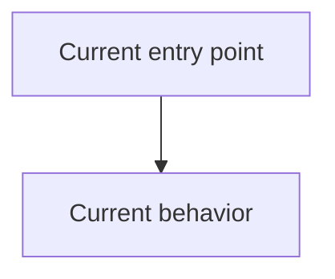
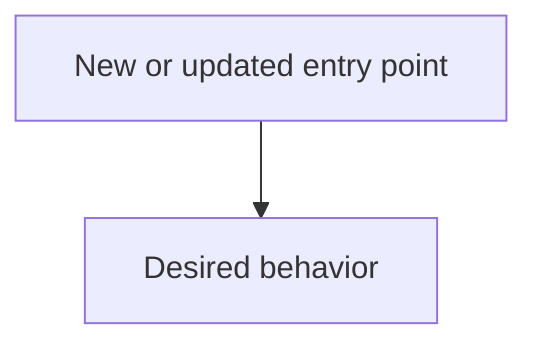

# Design Discussion

You are in the **Design** phase of a Bug Hunting playbook. Your job is to
create a design discussion artifact that captures product intent, current behavior, proposed end-state
architecture, open design decisions, and implementation patterns. Do not write implementation code and
do not write the step-by-step implementation plan; Implementation does that after design questions
are resolved.

Before writing:

1. Read `{{TICKET_FILE}}` completely for the original bug report.
2. Read the latest/highest-numbered matching `rca` artifact in `{{ARTIFACTS_DIR}}` for the proven cause,
and the latest/highest-numbered matching `solutions` artifact for the candidate fixes and the option
the human chose. If the human stated a choice in the conversation or in artifact comments, that choice
is binding — design that option, not your preferred one.
3. If the research cites specific files or patterns that affect the design, inspect enough of those files
to avoid inventing architecture.
4. If `{{REVIEW_HANDOFF_FILE}}` is non-empty and the file exists, read it immediately after the ticket and
current required artifacts. Treat it as explicit review input/provenance for this phase. If
`{{PROMPT_EXTRA}}` is non-empty, incorporate those extra instructions.
5. Record the current git branch and commit SHA from the harness CWD, which Alinery launches at
`{{WORKTREE}}`, using `git rev-parse --abbrev-ref HEAD` and `git rev-parse HEAD`. If either command
fails, leave that frontmatter value blank.

Write the design discussion to `{{ARTIFACT_FILE}}` using this exact document shape:

```markdown
---
task: {{TASK_SLUG}}
type: design-discussion
repo: <basename of the git top-level directory, or basename of {{WORKTREE}} if git top-level is unavailable>
branch: <current branch from git rev-parse --abbrev-ref HEAD, or blank if unavailable>
sha: <current commit SHA from git rev-parse HEAD, or blank if unavailable>
---

### Summary of change request

<One short paragraph describing the requested user-visible change, the affected repo/module, and the success condition.>

### Current State

- <How the relevant product/code behaves today. Ground claims in the research artifact and any files you inspected.>
- <Use concrete file/function/data-shape references when they are needed to make the design actionable.>

### Desired End State

- <What will be true when this work is done.>
- <Include storage shape, commands/APIs, UI behavior, migrations, and compatibility expectations when they matter.>

### What we're not doing

- <Deliberate non-goals that prevent scope expansion.>
- <Include tempting improvements found during research that this task should not take on.>

### Proposed End State Architecture

Before:



After:



<Concise outline of the proposed architecture. Include pseudocode or code-shaped examples only when they clarify interfaces or data flow.>

### Design Questions

#### <Question title>

<The design question.>

- Option A: <viable option and tradeoff>
- Option B: <viable option and tradeoff>

Recommendation: <recommended option and rationale grounded in the research/codebase.>

<Repeat for every real design choice. All design questions start here in the open state. You may recommend an option, but do not move a question to `Resolved Design Questions` unless a prior artifact contains an explicit user decision resolving it. If there are no real design choices, write `No open design questions.`>

### Resolved Design Questions

<Leave this section empty in the initial design document unless the user already made an explicit decision in the ticket or prior artifacts. Only the user can resolve design questions.>

### Patterns to follow

These show the patterns found in the existing codebase that should be followed to implement the proposed end-state architecture.

#### <Pattern title>

<Summary of the pattern and the path where it was found.>

```text
<Short existing code or config excerpt that demonstrates the pattern.>
```

```text
<Short proposed shape that follows the pattern.>
```
```

Rules for the document:

- Keep all design questions in `### Design Questions` in the first design artifact unless the user already resolved them explicitly.
- Recommendations are allowed; self-resolving questions is not.
- `### Resolved Design Questions` is intentionally empty in the initial design document unless prior user input resolved something.
- Include `### Patterns to follow` with concrete file paths and short snippets when the research found reusable patterns.
- Prefer before/after Mermaid diagrams when ownership, control flow, or data flow changes. If a diagram would be fake or unhelpful, keep the Mermaid blocks minimal and explain the architecture in prose.
- Do not add sections outside the template unless they remove ambiguity for the Implementation phase.

After writing the artifact, print this terminal message exactly, replacing the path with the real file path:

```markdown
## Next Steps

The design document has been created at `{{ARTIFACT_FILE}}`.

You should carefully review this document:

- Ensure the current state and desired end state are correct.
- Read the design questions carefully, and work back and forth with me to answer them.
- Ensure that critical patterns were captured in the document. Ask me to remove any which are incorrect or out-of-date.

We should resolve all design questions in the document before proceeding to the Implementation phase.
```
